# TravelBot
## Задание
«Мотя» — дружелюбный чат-бот-кот, который помогает путешественникам быстро собирать микро-маршруты по России (старт — Санкт-Петербург), открывать локальные места, получать «паспорта путешественника» и связывать офлайн-точки (открытки/QR) с онлайн-контентом TEA-экосистемы (лонгрид, мерч, туры).
## Автор
Каменский Илья ИП-23-3
## Использование
Добавление посещенных мест производится через сканирование QR-кода
- /start - Начать работу с ботом
- *Показать маршруты* - Отобразить актуальные маршруты
- *Мой паспорт* - Показать туристический паспорт
- *Помощь* - справка по боту для пользователя
- *Контакты* - связь с указанными контактами
## Администрирование
Управление ботом происходит через Web-панель администратора. Администратору выдается логин и пароль для доступа.
## Схема базы данных

```mermaid
erDiagram
    User ||--|| Passport : owns
    Place ||--|| Category : has
    Passport ||--o{ PassportPlace : contains
    Place ||--o{ PassportPlace : visited
    Route ||--o{ RoutePlace : includes
    Place ||--o{ RoutePlace : included_in

    User {
        Guid Id
        string Name
        long TelegramId
        Guid PassportId
    }

    Admin {
        Guid Id
        string Name
        string Login
        string PasswordHash
    }

    Passport {
        Guid Id
        Guid UserId
    }

    PassportPlace {
        Guid Id
        Guid PassportId
        Guid PlaceId
    }

    Category {
        Guid Id
        string Name
    }

    Route {
        Guid Id
        string ReasonToVisit
        string StartPoint
        Season Season
        string Budget
        int AverageTime
    }

    RoutePlace {
        Guid Id
        Guid RouteId
        Guid PlaceId
    }

    Place {
        Guid Id
        string Name
        string Description
        Guid CategoryId
        bool ChildFriendly
        string Metro
        string Address
        string Link
    }
```

